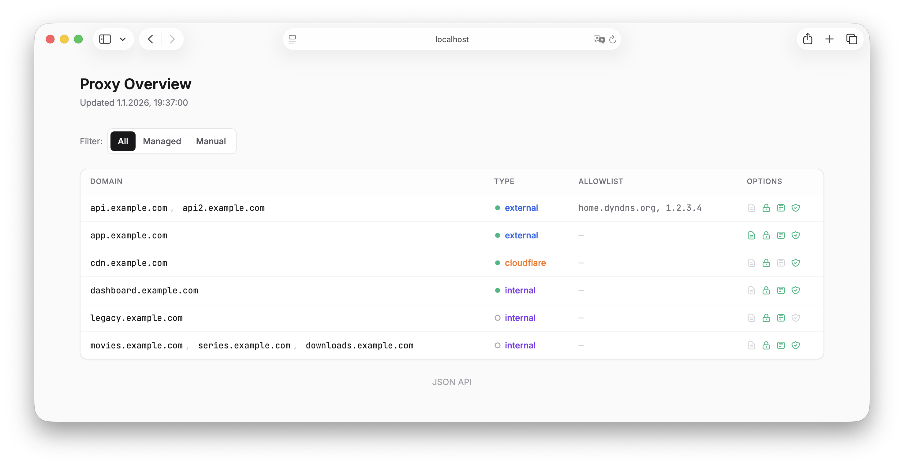

# Caddy Reverse Proxy

Docker-based Caddy reverse proxy with automatic service discovery.

## Quick Start

```bash
# Clone and configure
git clone https://github.com/hueske-digital/caddy
cd caddy
cp .env.example .env
# Edit .env with your Cloudflare API token and email

# Start
make up
```

### Available Commands

| Command | Description |
|---------|-------------|
| `make up` | Start Caddy only |
| `make up-auth` | Start Caddy + TinyAuth |
| `make up-all` | Start all services |
| `make down` | Stop all services |
| `make logs` | Follow logs |

> **Note:** All commands use Docker Compose profiles. Running `make up` after `make up-auth` won't stop TinyAuth - it continues running. Use `make down` to stop everything.

## How It Works

The **watcher** sidecar automatically discovers services and generates Caddy configs:

1. Your service joins a `*_caddy` network
2. Watcher detects it and connects Caddy to that network
3. Watcher reads `CADDY_*` environment variables from your service
4. Caddy config is generated and auto-reloaded

## Service Configuration

Add these environment variables to any service:

```yaml
services:
  myapp:
    image: myapp:latest
    environment:
      # Required
      - CADDY_DOMAIN=app.example.com         # Domain(s), comma-separated
      - CADDY_TYPE=external                  # external|internal|cloudflare
      - CADDY_PORT=8080                      # Container port
      # Optional - enabled by default
      - CADDY_TLS=false                      # Use HTTP challenge instead of Cloudflare DNS
      - CADDY_COMPRESSION=false              # Disable zstd/gzip compression
      - CADDY_HEADER=false                   # Disable security headers
      - CADDY_PERFORMANCE=false              # Disable static asset caching
      - CADDY_SECURITY=false                 # Disable sensitive file blocking
      # Optional - disabled by default
      - CADDY_ALLOWLIST=home.dyndns.org      # IP allowlist (external only)
      - CADDY_AUTH=true                      # Enable forward auth (requires tinyauth)
      - CADDY_AUTH_PATHS=/admin/*,/api/*     # Protect only these paths (default: entire site)
      - CADDY_SEO=true                       # Allow search engine indexing
      - CADDY_WWW_REDIRECT=true              # Redirect www to non-www
      - CADDY_WORDPRESS=true                 # Enable WordPress security rules
      - CADDY_LOGGING=true                   # Enable request logging
    networks:
      - caddy

networks:
  caddy:
```

### Types

| Type | Access |
|------|--------|
| `external` | Public (or restricted via allowlist) |
| `internal` | Private IP ranges only (10.x, 172.16-31.x, 192.168.x) |
| `cloudflare` | Cloudflare IP ranges only |

### Allowlist

Restrict `external` services by IP:

```yaml
CADDY_ALLOWLIST=home.dyndns.org,office.example.com,1.2.3.4
```

- Hostnames resolved via DNS-over-HTTPS (Cloudflare/Google)
- Auto-refreshes every 60 seconds
- Non-matching requests: connection aborted

## Manual Configs

Place custom `.conf` files in:
- `hosts/internal/` - internal services
- `hosts/external/` - public services
- `hosts/cloudflare/` - Cloudflare-proxied services

## Wildcard Certificates

For many subdomains of the same domain, use wildcard certificates to avoid rate limits and keep subdomains private (not exposed in Certificate Transparency logs):

```bash
# In .env or docker-compose.yml
WILDCARD_DOMAINS=example.com,other.com
```

This generates configs in `hosts/external/` that obtain wildcard certs via DNS challenge. All services using subdomains (e.g., `app.example.com`, `api.example.com`) automatically use the wildcard cert (Caddy 2.10+).

Available snippets (defined in `hosts/base.conf`):

**IP Matchers:**
- `(internal)` - private IP ranges (10.x, 172.16-31.x, 192.168.x)
- `(cloudflare)` - Cloudflare proxy IPs

**Auto-enabled** (disable with `CADDY_*=false`):
- `(tls)` - Cloudflare DNS challenge for wildcard/internal domains
- `(compression)` - zstd/gzip compression
- `(header)` - security headers (HSTS, no indexing, hide server info)
- `(performance)` - static asset caching (1 year), skip logs for favicon/robots
- `(security)` - block .env, .git, .bak, .sql, and other sensitive files

**Opt-in** (enable with `CADDY_*=true`):
- `(logging)` - request logging to stdout
- `(seo)` - allow search engine indexing (removes X-Robots-Tag)
- `(auth)` - forward auth via tinyauth (requires docker-compose.auth.yml)
- `(wordpress)` - block PHP execution in wp-content/uploads, plugins, themes

## Authentication

Optional forward auth via tinyauth + OIDC provider (e.g., PocketID, Authelia):

```bash
# Configure in .env
TINYAUTH_SECRET=random-secret
TINYAUTH_APP_URL=https://auth.example.com
TINYAUTH_DOMAIN=auth.example.com
OIDC_PROVIDER_URL=https://pocketid.example.com
OIDC_CLIENT_ID=tinyauth
OIDC_CLIENT_SECRET=your-secret

# Start with auth
make up-auth
```

Then enable per service:
```yaml
environment:
  - CADDY_AUTH=true
```

## Status Dashboard

Set `CADDY_DOMAIN` in `.env` to enable the built-in status page. Defaults to `internal` access on port `8080`.



## Environment Variables

### Required (`.env`)

| Variable | Description |
|----------|-------------|
| `CF_API_TOKEN` | Cloudflare API token (Zone Read + DNS Edit) |
| `EMAIL` | Email for SSL notifications |

### Optional (docker-compose)

| Variable | Default | Description |
|----------|---------|-------------|
| `NETWORK_SUFFIX` | `_caddy` | Network suffix to watch |
| `HOSTS_DIR` | `/hosts` | Config output directory |
| `DNS_REFRESH_INTERVAL` | `60` | Seconds between DNS refreshes |
| `CODE_EDITOR_URL` | - | Base URL for editor links in status page |
| `WILDCARD_DOMAINS` | - | Domains for wildcard certificates (comma-separated) |

### Optional (`.env`)

| Variable | Description |
|----------|-------------|
| `CADDY_DOMAIN` | Status page domain (enables dashboard) |

## Ports

Required for external access:
- `80/tcp` - HTTP + Let's Encrypt
- `443/tcp` - HTTPS
- `443/udp` - HTTP/3

## Legacy Migration

For existing services using `proxy_apps` network with manual configs:

```bash
# Create legacy network (if not exists)
docker network create proxy_apps
```

- Legacy services continue working with manual `.conf` files
- New services use `*_caddy` networks with auto-discovery
- Migrate gradually by adding `CADDY_*` env vars

## Testing

### Unit Tests

```bash
cd watcher && go test -v ./...
```

Tests core functionality without Docker:
- `ParseCaddyEnv` - Environment variable parsing and validation
- Template generation for all types (internal/external/cloudflare)
- Config file writing and removal
- Domain extraction from config files
- Option handling (logging, TLS, compression, headers)

### Integration Tests

```bash
./watcher/test/integration.sh
```

Full end-to-end tests with Docker containers:

| Test | Description |
|------|-------------|
| Service start | Creates config when container with `CADDY_*` vars starts |
| Service stop | Config persists when container stops (not removed) |
| Service down | Config and network removed on `docker compose down` |
| External type | Config created in `hosts/external/` |
| Cloudflare type | Config includes `import cloudflare` directive |
| Logging option | `CADDY_LOGGING=true` adds `import logging` |
| Auth option | `CADDY_AUTH=true` adds `import auth` (all types) |
| SEO option | `CADDY_SEO=true` adds `import seo` for indexing |
| WWW redirect | `CADDY_WWW_REDIRECT=true` adds www to non-www redirect |
| WordPress option | `CADDY_WORDPRESS=true` adds `import wordpress` |
| Performance/Security | Enabled by default, disable with `=false` |
| Disabled options | `CADDY_TLS/COMPRESSION/HEADER=false` removes imports |
| Multiple domains | Comma-separated domains all included in config |
| File ownership | Files created with UID/GID 1000:1000 (Linux only) |
| Status API | `/api/status` returns valid JSON (if enabled) |

Options:
```bash
# Keep caddy stack running after tests (for debugging)
./watcher/test/integration.sh --keep-stack
```

The integration tests automatically:
- Build the watcher image locally
- Start the caddy stack if not running
- Clean up test containers and networks
- Stop the stack after tests (unless `--keep-stack`)

### Pre-Push Hook

Enable automatic testing before push:

```bash
git config core.hooksPath .githooks
```

This runs unit tests before every `git push`. If tests fail, push is aborted.

## Notes

- Set Cloudflare SSL mode to **Full (strict)**
- Caddy auto-reloads when configs change
- Generated configs are gitignored
